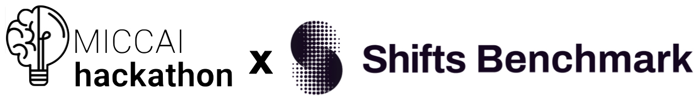

<!--
*** Thanks for checking out the Best-README-Template. If you have a suggestion
*** that would make this better, please fork the repo and create a pull request
*** or simply open an issue with the tag "enhancement".
*** Thanks again! Now go create something AMAZING! :D
***
***
***
*** To avoid retyping too much info. Do a search and replace for the following:
*** github_username, repo_name, twitter_handle, email, project_title, project_description
-->


<!-- PROJECT SHIELDS -->
<!--
*** I'm using markdown "reference style" links for readability.
*** Reference links are enclosed in brackets [ ] instead of parentheses ( ).
*** See the bottom of this document for the declaration of the reference variables
*** for contributors-url, forks-url, etc. This is an optional, concise syntax you may use.
*** https://www.markdownguide.org/basic-syntax/#reference-style-links
-->
[![Contributors][contributors-shield]][contributors-url]
[![Forks][forks-shield]][forks-url]
[![Stargazers][stars-shield]][stars-url]
[![Issues][issues-shield]][issues-url]
[![MIT License][license-shield]][license-url]
[![LinkedIn][linkedin-shield]][linkedin-url]


<!-- PROJECT LOGO -->
<br />
<p align="center">
  <a href="https://github.com/maragraziani/miccaihackathon_shifts">
    
  </a>

  <h3 align="center">Domain Shifts Between Clinical Annotators</h3>

  <p align="center">
    Task 1 at the MICCAI Hackathon 2022
    <br />
    Mentored by: »
    <a href="mailto:mara.graziani@hevs.ch">Mara Graziani</a>
    &
    <a href="mailto:henning.mueller@hevs.ch">Henning Müller</a>
  </p>
</p>

<!-- ABOUT THE PROJECT -->
## Task Overview

Medical imaging datasets are known to be highly heterogeneous, being often collected at multiple institutions and resulting in so-called domain-shifts between institutions. At the level of manual segmentations, annotators trained in one institution may follow slightly different annotation procedures, e.g. over- and under-segmenting, and this may bias the learning process. 

In this task, you will investigate the domain shifts in white matter (WM) lesion segmentation:
<ol>
<li> Discuss, identify and quantify the impact of <strong>multiple sources of shift</strong> within the multiple sclerosis dataset of WM lesions in the Shifts 2.0 publicly available <a href=https://shifts.ai/dataset#white-matter-multiple-sclerosis-lesion-segmentation> dataset </a>.
<li>Quantify the impact of multiple annotators as opposed to a single annotator in terms of model uncertainty. <strong>How does model uncertainty compare against annotator variance?</strong> How does model uncertainty vary against the number of annotations considered to create the “golden reference”? Does the uncertainty decrease if more annotators are used?
  <li>How many annotators in the given dataset <strong>over-segment</strong> the “golden reference”? How many <strong>under-segment</strong>? What is the observed bias introduced by each of the annotators?
 
# About the Shifts Project and the Upcoming Shifts 2.0 Challenge 
 
  The [Shifts Project](https://shifts.ai) is an international collaboration of academic and industrial researchers dedicated to studying distributional shift — one of the biggest challenges in applying machine learning to high-stakes real-world tasks.
   A second iteration of the [Shifts Challenge](https://shifts.ai/challenges) is foreseen very soon. The competition will consist of two new tracks, each corresponding to a high-risk application affected by distributional shift: marine cargo vessel power estimation and White Matter Multiple Sclerosis lesion segmentation in 3D Magnetic Resonance Imaging of the brain. Both tasks are strongly affected by distributional shift and have strict requirements on robustness. Furthermore, both applications are socially relevant: the former in terms of lowering carbon emissions of supply chains and the latter in terms of alleviating a widespread, incurable and degenerative illness.

<!-- GETTING STARTED -->
# Getting Started
 
## Dataset

You will be working with a <strong>subset</strong> of the training data provided in Track 1 of the Shifts 2.0 challenge. 
More information about the dataset and instruction on how to access the download page can be found in the [data](#) folder of this repo.

[Note] The MSSEG directory in the dataset contains the data that you need to participate to the hackathon, namely the independent annotation masks obtained by 7 different annotators. These files were used to generate a consensus map (by majority voting) used as the golden reference in our [baseline model](#). Note that in the Best directory of the repo there are also two individual annotators (one more experienced than the other). The golden reference is in this case the expert annotator.
       
## Dependencies

* [Python 3.8](www.python.org)
* [PyTorch 1.12.0](www.pytorch.org)
* [Monai 0.9.0](www.monai.io)

See the full list of dependencies [here](https://github.com/Shifts-Project/shifts/blob/main/mswml/requirements.txt). 

## Model training 

We provide you with different baseline models and the instructions to train them on the provided dataset. 
For some of these models, we directly release the pretrained weights to facilitate the participation in the hackathon. 

The "challenge-baseline" model was trained on the canonical splits proposed in the Shifts 2.0 challenge. 
You can access the model at this <a href="https://github.com/Shifts-Project/shifts/tree/main/mswml">repo</a> and its [pretrained weights](#). 

To train the challenge-baseline, run:

```bash
#!/bin/bash
for seed in 1 2 3
do
	python mswml/train.py \
	--seed $seed \
	--path_train_data /path/to/train/FLAIR \
	--path_train_gts /path/to/train/ground/truth/masks \
	--path_val_data /path/to/val/FLAIR \
	--path_val_gts /path/to/val/ground/truth/masks \
	--path_save "/path/to/baselines/dir/${seed}"
done
```

Annotator-specific baseline models can also be used to further verify the impact of individual annotators biases on the model training. We are training the models on our servers and we will release them in the coming future in the directory [annotator-models](#) of this repo. 
Alternatively, you can train your annotator-specific baseline models by changing the path_train_gts and path_val_gts when training the baseline models.

## Inference and Uncertainty Mask Generation
	  
Check the [notebooks](#) folder of this repo for a quick tutorial on how to generate the uncertainty masks for each input image and for instructions on how to process and save the 3D uncertainty masks. 
	  
<!-- LICENSE -->
## License

Distributed under the Apache License. See `LICENSE` for more information.


<!-- CONTACT -->
## Contact

Mara Graziani - Hes-so Valais - [@mormontre](https://twitter.com/mormontre) - mara.graziani@hevs.ch

Vatsal Raina - University of Cambridge - contact

Nataliia Molchanova - Université de Lausanne & Hes-so Valais - contact

<!-- ACKNOWLEDGEMENTS -->
## Acknowledgements

* [Shifts project](www.shifts.ai)
* [AI4Media](https://wp.unil.ch/mial/research/projects/msxplain/)
* [MSXPlain](https://wp.unil.ch/mial/research/projects/msxplain/)

## Project PIs

* Andrey Malinin 
* Henning Müller
* Meri Bach Cuadra

<!-- MARKDOWN LINKS & IMAGES -->
<!-- https://www.markdownguide.org/basic-syntax/#reference-style-links -->
[contributors-shield]: https://img.shields.io/github/contributors/maragraziani/miccaihackathon_shifts.svg?style=for-the-badge
[contributors-url]: https://github.com/maragraziani/miccaihackathon_shifts/graphs/contributors
[forks-shield]: https://img.shields.io/github/forks/maragraziani/miccaihackathon_shifts.svg?style=for-the-badge
[forks-url]: https://github.com/maragraziani/miccaihackathon_shifts/network/members
[stars-shield]: https://img.shields.io/github/stars/maragraziani/miccaihackathon_shifts.svg?style=for-the-badge
[stars-url]: https://github.com/maragraziani/miccaihackathon_shifts/stargazers
[issues-shield]: https://img.shields.io/github/issues/maragraziani/miccaihackathon_shifts.svg?style=for-the-badge
[issues-url]: https://github.com/maragraziani/miccaihackathon_shifts/issues
[license-shield]: https://img.shields.io/github/license/maragraziani/miccaihackathon_shifts.svg?style=for-the-badge
[license-url]: https://github.com/maragraziani/miccaihackathon_shifts/blob/master/LICENSE
[linkedin-shield]: https://img.shields.io/badge/-LinkedIn-black.svg?style=for-the-badge&logo=linkedin&colorB=555
[linkedin-url]: https://www.linkedin.com/in/mara-graziani-878980105/
